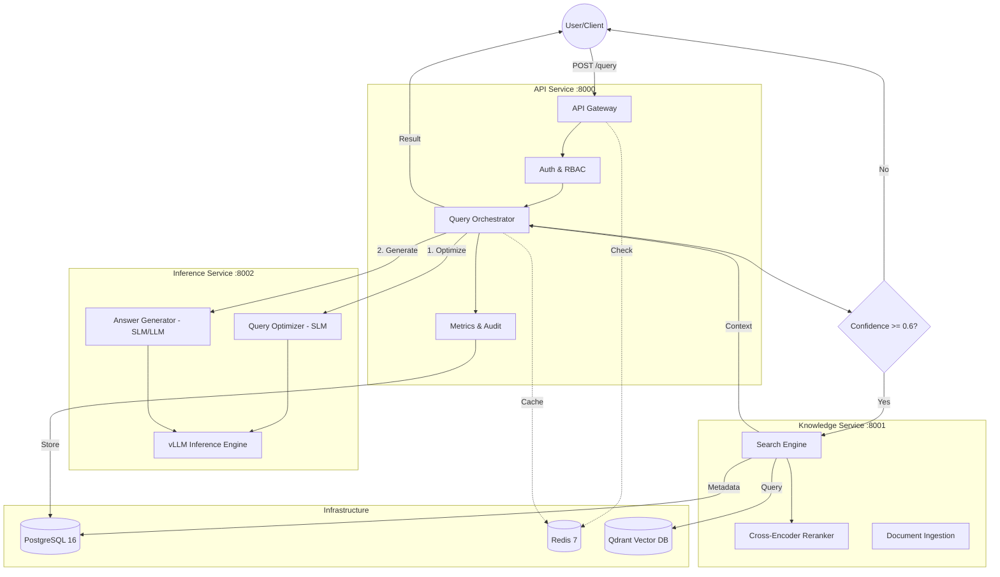

# Enterprise SLM-First Knowledge Copilot

**High-performance RAG orchestration engine leveraging Small Language Models (SLMs) for intelligent query routing, semantic retrieval, and cost-optimized generation.**

---

## 1. Project Overview
The **Enterprise SLM-First Knowledge Copilot** is a production-grade Retrieval-Augmented Generation (RAG) system. Unlike traditional RAG implementations that over-rely on large-scale LLMs, this system employs a **tiered inference strategy**. It utilizes fine-tuned Small Language Models (SLMs) for query optimization, intent classification, and confidence scoring, escalating to heavy-compute models only when the system detects high complexity or low retrieval confidence.

## 2. Problem Statement
Enterprise RAG systems frequently suffer from three primary failure modes:
1.  **Economic Inefficiency:** Using 70B+ parameter models for simple retrieval and summarization tasks leads to prohibitive operational costs.
2.  **Retrieval Noise:** Raw user queries are often underspecified, leading to poor vector search performance and "hallucinated" context.
3.  **Security Gaps:** Lack of document-level RBAC and robust token lifecycle management makes standard RAG unsuitable for multi-tenant enterprise data.

This system solves these issues by introducing an **Inference-Guided Orchestration** layer that clarifies intent before execution and enforces security at every hop.

## 3. Solution Overview
*   **SLM-First Orchestration:** Uses a fine-tuned `Qwen2.5-1.5B` for query expansion and confidence scoring.
*   **Tiered Retrieval:** Integrates BGE embeddings with a cross-encoder reranking stage to maximize Precision@K.
*   **Consolidated Microservices:** A balanced 3-service architecture (API, Knowledge, Inference) that minimizes network overhead while maintaining horizontal scalability.
*   **Production-Grade Security:** Implements advanced JWT patterns including refresh token reuse detection and document-level RBAC.

## 4. Architecture

### System Flow Diagram


### Component Breakdown
*   **API Service:** Central orchestrator handling the query lifecycle, state management (Redis), and asynchronous metrics persistence (PostgreSQL).
*   **Inference Service:** A dedicated ML compute node serving models via **vLLM**. It handles both the Query Optimizer (SLM) and the Generator (SLM/LLM).
*   **Knowledge Service:** Manages the data plane. It coordinates between **Qdrant** for vector similarity and **PostgreSQL** for relational document metadata.

## 5. Tech Stack

| Layer | Technology | Rationale |
| :--- | :--- | :--- |
| **API Framework** | FastAPI | Asynchronous concurrency for high-throughput I/O. |
| **Inference Engine** | vLLM | PagedAttention for optimized GPU memory utilization. |
| **Models** | Qwen2.5-1.5B / BGE-Small | Balanced performance-to-latency ratio for SLM tasks. |
| **Vector Store** | Qdrant | Native gRPC support and advanced filtering for RBAC. |
| **Relational DB** | PostgreSQL 16 | System of record for users, audit logs, and metadata. |
| **Caching/Queue** | Redis 7 | Multi-purpose layer for rate-limiting, Caching, and Ingestion. |
| **Observability** | Prometheus / OTEL | Full-stack distributed tracing and metric aggregation. |

## 6. Deployment Architecture
*   **Infrastructure:** Containerized via Docker; designed for Kubernetes deployment using Helm.
*   **Node Separation:** 
    *   **CPU Nodes:** API Service, Knowledge Service, Databases.
    *   **GPU Nodes:** Inference Service (vLLM) with NVIDIA Triton or raw vLLM containers.
*   **Scaling:** Horizontally scalable API and Knowledge layers. Inference scales via HPA based on GPU VRAM utilization and request queue depth.

## 7. Observability & Performance
*   **Tracing:** Distributed tracing via OpenTelemetry, propagating `X-Request-ID` across service boundaries.
*   **Metrics:** Real-time tracking of:
    *   P95 Latency per service (Optimizer vs. Search vs. Generator).
    *   SLM Confidence distribution.
    *   Token usage (Input/Output) for cost accounting.
*   **Performance:** Designed to handle >100 RPS on standard commodity GPU hardware (A10G/L4).

## 8. Security Considerations
*   **Auth N/Z:** OAuth2 + JWT with strict role-based access control.
*   **Token Security:** **Refresh Token Reuse Detection** logic automatically revokes all active sessions for a user if a compromised token is detected.
*   **Data Isolation:** Multi-tenant architecture where Qdrant collections are filtered by `user_role` and `department` tags at query time.
*   **Audit Trail:** Immutable audit logs in PostgreSQL tracking all data access and system modifications.

## 9. Local Setup Instructions
```bash
# 1. Clone & Sync (using UV for predictable builds)
git clone <repo_url> && cd slm_first
uv sync

# 2. Launch Infrastructure
docker compose up -d postgres redis qdrant vllm

# 3. Initialize Data Plane
python -m services.api.database.init_db

# 4. Start Application Services
# (Run in separate terminals or as background processes)
uvicorn services.api.main:app --port 8000
uvicorn services.knowledge.main:app --port 8001
uvicorn services.inference.main:app --port 8002
```

## 10. Design Decisions & Tradeoffs
*   **Consolidation (7 ➔ 3 Services):** The system was refactored from 7 services to 3 to reduce network serialization overhead and simplify the distributed tracing surface area without sacrificing the ability to scale compute-intensive ML separately.
*   **In-Process Auth:** JWT validation is handled in-process within the API Gateway to eliminate the "Auth Service Hop" on every request, reducing latency by ~15-20ms.
*   **Hybrid Database Pattern:** Chose not to use `pgvector` in favor of **Qdrant** to leverage dedicated vector indexing performance and gRPC streams for bulk ingestion.

## 11. Roadmap
*   [ ] **Hybrid Search:** Integration of BM25 lexical search with vector retrieval.
*   [ ] **Tool Use:** Expanding the SLM optimizer to support function calling for live data retrieval.
*   [ ] **Quantization:** Moving to AWQ/FP8 for the Inference layer to double throughput on 4090/A100 hardware.

## 12. License
Distributed under the MIT License. See `LICENSE` for more information.
